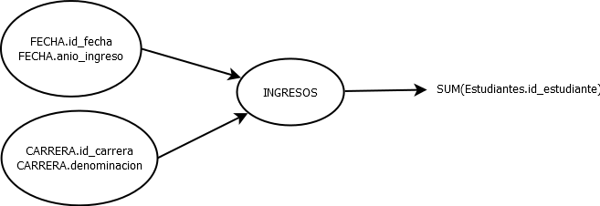
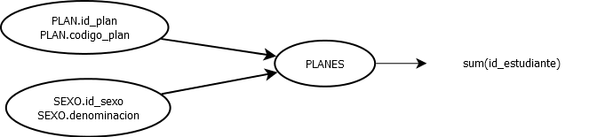
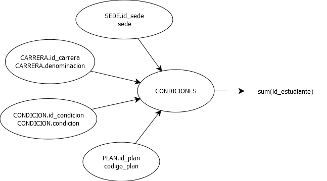

# Tp03-Tp03DataWareHouse
### 1. Se cuenta con el siguiente Diagrama Entidad-Relación que representa un esquema reducido de la Base de datos transaccional de una Universidad:

##### - a. ¿Cuantos estudiantes posee una Carrera C con año de ingreso A?

##### - b. ¿Cuántos estudiantes discriminados por sexo posee el Plan de Estudios P?

##### - c. ¿Cuántos estudiantes en la condición N posee la Carrera C por cada Plan de Estudios en una Sede determinada?

### 2. Ahora, analice la Base de Datos de Rendimiento_Académico del “TP01 Definición de Procesos ETL”:

##### - a. Su diseño, ¿corresponde a alguno de los esquemas de DW estudiados en clase? ¿A cuál?,

El diseño se corresponde con el esquema tipo estrella, debido a que las tablas no se encuentran normalizadas, esto podemos observar con la tabla ciudades, donde tenemos al atributo provincias, el cual podria estar en una tabla a parte, sin embargo esta en la tabla de ciudades.

##### - b. Realice una reingeniería y define el Modelo Conceptual y Modelo Conceptual ampliado que permita ese modelo físico.

