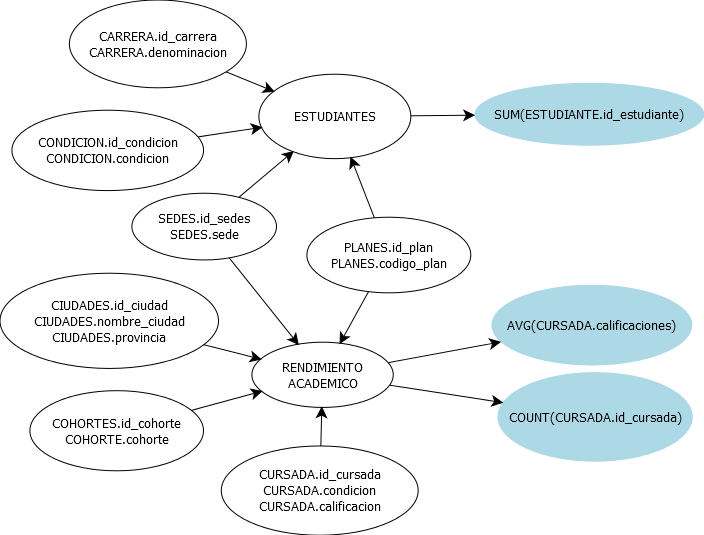

# Tp03-Tp03DataWareHouse
### 1. Se cuenta con el siguiente Diagrama Entidad-Relación que representa un esquema reducido de la Base de datos transaccional de una Universidad:

##### - a. ¿Cuantos estudiantes posee una Carrera C con año de ingreso A?
##### - b. ¿Cuántos estudiantes discriminados por sexo posee el Plan de Estudios P?
##### - c. ¿Cuántos estudiantes en la condición N posee la Carrera C por cada Plan de Estudios en una Sede determinada?

### 2. Ahora, analice la Base de Datos de Rendimiento_Académico del “TP01 Definición de Procesos ETL”:

##### - a. Su diseño, ¿corresponde a alguno de los esquemas de DW estudiados en clase? ¿A cuál?,

El diseño se corresponde con el esquema tipo estrella, debido a que las tablas no se encuentran normalizadas, esto podemos observar con la tabla ciudades, donde tenemos al atributo provincias, el cual podria estar en una tabla a parte, sin embargo esta en la tabla de ciudades.

##### - b. Realice una reingeniería y define el Modelo Conceptual y Modelo Conceptual ampliado que permita ese modelo físico.

##### - c. Defina un modelo lógico alternativo que le permita migrar a otro de los esquemas de DW estudiados en clase.

### 3. Se cuenta con el siguiente Modelo Conceptual, el cual representa un esquema reducido de una Empresa que se dedica a la venta de artículos de librería por internet:

##### - Utilizando una herramienta gráfica de diseño, genere el Modelo Conceptual Ampliado, Lógico y Físico del Data Warehouse.

### 4. Se hace notar que la estructura de la Base de Datos del Punto 1 del “TP01 Definición de Procesos ETL” corresponde a uno de los posibles esquemas de DW. ¿A cuál? ¿Por qué?

Se podria decir que la estructura se corresponde con un esquema del tipo copo de nieve, ya que las tablas se encuentran normalizadas, salvo por los atributos nombre y direccion que podrian estar demas, si tomamos a la tabla medios como tabla hecho y dimensiones a las demas tablas. 

##### 5. Implemente los cubos de los esquemas de los enunciados 2) y 4) a partir de la herramienta Mondrian Schema Workbench.

